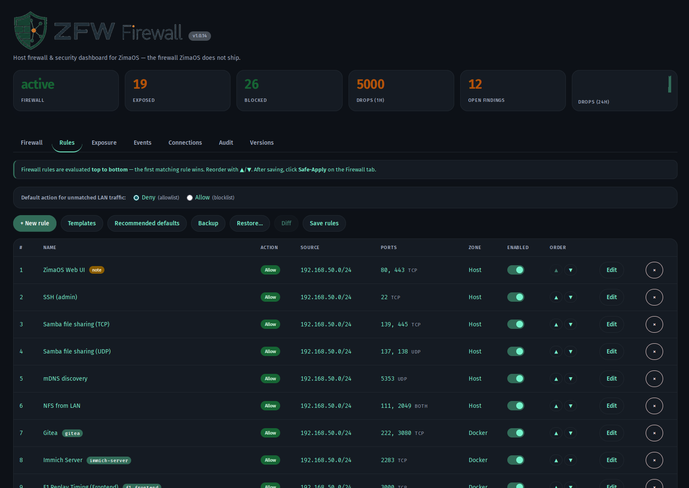
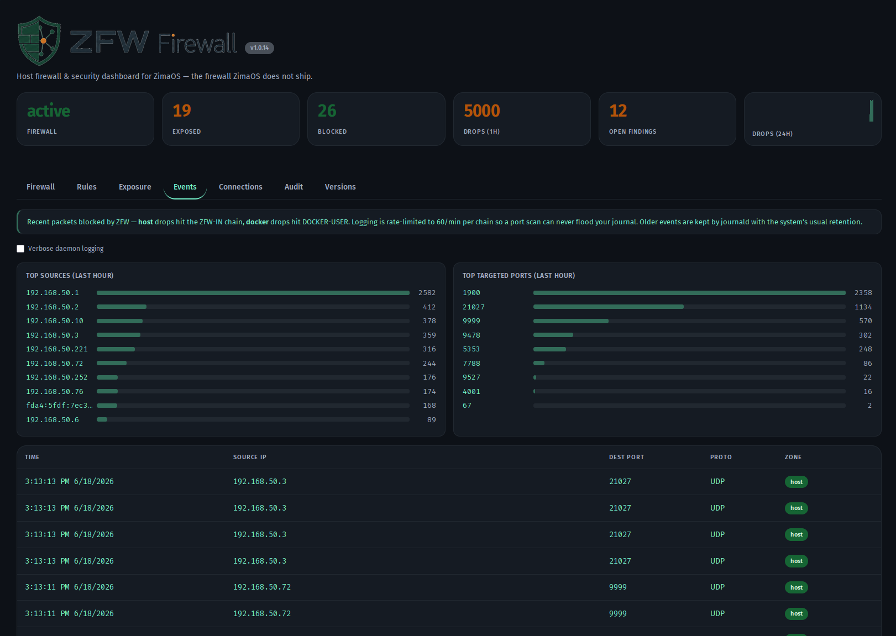

<p align="center">
  
</p>

# ZFW — a host firewall for ZimaOS

> **Current release:** v1.0.24 — **ZimaOS' own remote access was being dropped by ZFW.** ZimaOS ships `znet` / **Zima Net**, IceWhale's built-in remote-access mesh (an embedded EasyTier), and it owns the interface `tun0`. ZFW bypassed every other mesh — `tailscale0`, ZeroTier's `zt+`, WireGuard's `wg+` — but not that one, so every inbound packet arriving through Zima Net hit the catch-all DROP. Measured on a ZimaCube: `ZFW-IN-DROP IN=tun0 SRC=10.126.126.20 DST=10.126.126.10 PROTO=TCP DPT=9527`, 125 dropped SYNs in a single connection attempt, while the desktop client hung on "connecting" indefinitely and `tun0`'s tx counter sat at 668 bytes for days. Adding the bypass moved it within two seconds. **Fixed:** `tun0` is now in the bypass list of all four emitted chains — `ZFW-IN`, `ZFW-IN6`, `DOCKER-USER` and its IPv6 counterpart. The first fix, applied by hand, covered only `ZFW-IN` and was therefore incomplete; the test now asserts all four chain outputs so a partial addition cannot pass again. **Scope, measured rather than assumed:** Zima Net is not new in v1.7.1-beta1. The official ZimaOS **1.7.0** image — downloaded and checksum-verified against the published `checksums.txt` — already carries `/usr/bin/znet`, its unit, `usr/share/zimanet/VERSION` = `0.1.0-2.6.4`, a CasaOS module descriptor and a systemd preset reading `enable znet.service`. Zima Net is therefore shipped **and enabled by default** on stock 1.7.0, and every such host running ZFW &le; v1.0.23 is dropping its traffic.
>
> **Previous release:** v1.0.23 — **ZimaOS v1.7.1-beta1 renamed the session-token issuer, and the whole UI went dark.** Every tab reported `HTTP 401` and the dashboard stayed empty on hosts that had just taken the update. Nothing about ZFW had changed: it verifies the ZimaOS session token itself (the gateway proxies module routes without authenticating them), and part of that check is the token's `iss` claim — pinned to `casaos` so that the *refresh* token, which the user-service signs with the same key, cannot be replayed as a firewall session. In v1.7.1-beta1 the access token's issuer became `zimaos`, so ZFW rejected every genuine login with `invalid session: token issuer "zimaos" not accepted (want "casaos")`. **Fixed:** both `casaos` and `zimaos` are accepted, so ZFW works on v1.7.1+ *and* on v1.7.0 and older hosts. The refresh token kept its own issuer (`refresh`) through the rename and is still refused, along with any other issuer — the scoping that the check exists for is intact, and each half now has its own test. Measured against a live login on a v1.7.1-beta1 host, not inferred. **And made findable next time:** a refused session used to produce no log line at all — the reason went into the 401 body and nowhere else, so an outage that broke every request left `journalctl -u zfw-ui` looking normal. Rejections are now logged at `WARN` with the reason, the path and the client, rate-limited to one line per 30 s with a count of what was suppressed in between. The token is never logged.
>
> **Previous release:** v1.0.22 — **container ports were unreachable over IPv6, and nothing said so.** Reported from the field: a CMS published on 443 worked from the LAN and was dead from the internet, while every rule in the table read "Allow" and had been checked one by one. Cause: with Docker's ip6tables support off — the ZimaOS default — containers hold no IPv6 address and a v6 connection to a published port terminates on the host's docker-proxy listener, so it is filtered in `INPUT` (`ZFW-IN6`), never in `FORWARD`/`DOCKER-USER`. `ZFW-IN6` only ever received the *host* half of a rule's ports, so no Docker-published port had an allow there and every IPv6 client hit the catch-all DROP. IPv4 was fine the whole time via `DOCKER-USER` — which is exactly why testing from inside the LAN could not see it. The gap was invisible before v1.0.17, when `ZFW-IN6` was still written to the legacy table while the live path ran through nft and the chain was inert; upgrading across that line switches IPv6 filtering on for the first time. **Fixed:** rules now mirror their full port set into `ZFW-IN6` regardless of zone (`ports=all` on the Docker zone excepted — widening that would expose host services too, and it is reported instead). **Made visible:** a rule whose source is an IPv4 address or range cannot be matched on ip6tables at all — that is unavoidable, but it used to happen in silence, and `rules.Defaults` seeds *every* starter rule with the LAN CIDR as source. Such rules are now badged **IPv4 only** in the rule table with the reason and the fix, served by the new read-only `GET /api/rules/v6`. **Warned about:** a deny-by-default rule set on a host with a public IPv6 address where not one rule reaches `ZFW-IN6` now raises a banner on the Rules tab — that state drops every inbound IPv6 connection while the table reads green.
>
> **Previous release:** v1.0.21 — Apply now takes effect on already-open connections, not just new ones. A conntrack-based firewall accepts `ESTABLISHED,RELATED` before it ever consults a user rule, so blocking a port that already had a live connection left that connection flowing until it closed on its own — the block bit only *new* connections, and operators reached for a full disable/enable to force it. After a successful apply ZFW now flushes the kernel connection-tracking entries for exactly the ports that switched from allowed to denied, over ctnetlink `IPCTNL_MSG_CT_DELETE` — the same netlink interface the Connections tab reads, since ZimaOS ships no `conntrack` binary — so an established connection to a freshly blocked port drops at once instead of surviving the apply. The flush is **targeted** (only newly-denied ports, computed by diffing the applied rule set against the live one; the whole table is never touched, so unrelated long-lived connections are left alone) and **best-effort** (the rules are already live, so a flush failure is logged, not surfaced as an apply failure). The first apply after a daemon start flushes nothing, since there is no prior state to diff against.
>
> **Previous release:** v1.0.20 — a full code + security review, and the bugs it turned up. The headline: **the safety net reinstated what it caught.** The Safe-Apply dead-man (and the failed-apply rollback) flushed the live rules but left `zfw.service` enabled and pointing at the very `compiled.sh` it had just rolled back — so the lockout ruleset returned on the next reboot *or the next `dockerd` restart*, that time with no dead-man armed. Both paths now tear boot-persistence down together with the rules. Next to it, `arm_deadman` discarded the exit status of `systemd-run` and logged "DEADMAN ARMED" unconditionally, so Safe-Apply could run with **no rollback timer at all** while promising one; it fails closed now. The root-exec guard (root-owned, not world-writable) that `apply` enforced was **missing on `commit` and `revert`**, which run the same file with the same privileges — every engine invocation is checked. `compiled.sh` was written with a truncating `os.WriteFile` while `zfw.service` (`PartOf=docker.service`) could be reading it, so a routine `dockerd` restart could hand the engine a half-written root script; it is now published atomically. In `DOCKER-USER` the docker-bridge RETURNs sat *after* the user rules, so an inbound-looking "deny port 443" also killed every container's outbound HTTPS (`--ctorigdstport` carries no direction) — the bypasses are hoisted above the rules. Container-bound rules substituted only **TCP** ports, silently dropping a bound container's published UDP ports. And `journalctl --since` was given a UTC-formatted timestamp, which journalctl parses in **local** time: west of UTC the Events tab was permanently empty while the kernel was actively logging drops. Also: rate-limiting on `/api/system/containers`, SSRF-redirect hardening on the peer-push client, a geo cache that a 200-with-HTML captive-portal page can no longer overwrite, loopback detection across all of `127.0.0.0/8` (systemd-resolved's `127.0.0.53` was listed as LAN-reachable), a schedule validator that rejects `+9:30` (it compiled to an iptables error that took the entire firewall down), and an admin UI that no longer calls Google Fonts on every load.
>
> **Previous release:** v1.0.19 — the Connections tab finally works on ZimaOS ([#1](https://github.com/chicohaager/zfw/issues/1)). ZFW read the connection table from `/proc/net/nf_conntrack` and, failing that, from `conntrack(8)`. A stock ZimaOS kernel builds with `# CONFIG_NF_CONNTRACK_PROCFS is not set` and the image ships no `conntrack` binary, so both sources were unavailable and the tab was permanently empty — on a host that was tracking hundreds of flows. ZFW now reads **ctnetlink** (`CONFIG_NF_CT_NETLINK=y`), the kernel's netlink interface, in pure Go with no new dependency. Second, `/api/conntrack` no longer answers `200 []` when the table cannot be read: an unreadable table is a `503` naming the source that failed, and the UI shows that reason instead of wrongly blaming a missing kernel module.
>
> **Previous release:** v1.0.18 — follow-up to v1.0.17. `revert` (and therefore the Safe-Apply dead-man) never emptied the **IPv6** `DOCKER-USER` chain, which v1.0.17 started filling — so a "reverted" firewall kept silently dropping IPv6 traffic to published container ports while every status surface reported it was off. `revert` now restores that chain's stock `-j RETURN`, and `zfw status` shows it. The engine script also carried the same name-based backend guess fixed elsewhere in v1.0.17 (`case "$IPT" in *nft*)`), so on ZimaOS 1.6.2 its `revert`/`status` operated on the wrong IPv6 table. Finally, the UI, README and engine logs now say plainly that the dead-man **removes the firewall entirely** rather than restoring the previous rules.
>
> **Previous release:** v1.0.17 — two ZimaOS 1.6.2 fixes. **(1)** The iptables backend is now identified by asking the binary (`iptables -V` → `nf_tables`/`legacy`) instead of pattern-matching its name. On 1.6.2 the plain `iptables` symlink drives nf_tables despite having no `nft` in its name, so whenever the Docker-FORWARD probe missed — e.g. `zfwd` starting before `dockerd` — IPv6 was pinned to the empty legacy table and the dashboard reported "IPv6 protection ✗" while `ZFW-IN6` was live. **(2)** The published-port inventory that scopes the `DOCKER-USER` default-deny now unions docker-proxy sockets with `docker ps`. With `"userland-proxy": false` there is no docker-proxy, the inventory came up empty, and the per-port default-deny was silently not emitted at all — the firewall failed open behind a green tile. **(3)** The inventory is now protocol-aware: `parseDockerPorts` used to discard UDP mappings outright, so a container publishing e.g. `8181/udp` got neither an allow rule nor a deny rule and stayed reachable from any source while its TCP sibling was filtered. Published UDP ports now get both. Also new: the IPv6 `DOCKER-USER` chain is populated (it matters the moment Docker IPv6 is enabled), and an empty inventory under `default_policy=deny` is now logged as an error instead of passing silently.

ZFW is a standalone ZimaOS module that adds the one thing ZimaOS does not ship:
a **host firewall** — with a web UI and a live security dashboard.





## Why ZimaOS needs a firewall

ZimaOS ships with **no host firewall at all**. On a stock install every `iptables`
chain — `INPUT`, `FORWARD`, `OUTPUT` — has a default policy of `ACCEPT` and carries
no filtering rules, and there is no `nftables` ruleset either. This is not one host
misconfigured; it is the out-of-the-box state of the operating system.

The direct consequence: **every service listening on `0.0.0.0` is reachable from the
entire local network, and nothing in the OS can stop it.** That already covers
services ZimaOS itself ships and enables by default:

- **Samba/SMB** (445/139) and the **NFS + rpcbind** stack (2049/111) — file-sharing
  daemons open to the whole subnet. `rpcbind` on port 111 is a well-known
  reflection/amplification and information-disclosure vector.
- **Discovery services** — mDNS, WS-Discovery, SSDP/UPnP, LLMNR — broadcast services
  enabled by default.
- **The built-in VM console.** Virtual machines created through ZimaOS's built-in
  virtualization module expose their VNC console (port 5900 and up) **with no
  password**, bound to all interfaces. Any device on the LAN can point a VNC viewer
  at it and take full keyboard/mouse/screen control of the running VM. This is a
  shipped default — it affects every ZimaOS user who runs a VM.
- **The ZimaOS web UI** on port 80.

Then there is the app store. ZimaOS is built around one-click Docker apps, and a
published container port goes straight onto `0.0.0.0` — Docker's port mapping
bypasses the host entirely and is LAN-wide the instant the app starts. Many
widely-used self-hosted images **default to no authentication**: log viewers,
metrics dashboards, browser-desktop / noVNC images, admin panels. With no host
firewall, each such app is an open door on the network the moment it is installed —
and a ZimaOS user is *expected* to install apps freely; that is the product.

Finally, the LAN itself is no longer a trust boundary. A normal home network carries
smart TVs, IoT gadgets, a games console, guests' phones — any one of which can be
compromised and is then a direct peer of the NAS that holds all your data.

ZimaOS is marketed as a plug-and-play homelab/NAS appliance for people who are
explicitly *not* network engineers. Expecting every owner to hand-audit service
bindings is unrealistic. A firewall is the single systemic control that closes this
entire class of exposure at once. That is what ZFW provides.

> ZFW grew out of a hands-on security audit. That audit ran on a heavily customised
> host with many self-installed apps — those host-specific findings are deliberately
> **not** the argument here. The argument is the stock ZimaOS baseline described
> above, which is identical on every install.

## What ZFW does

A standalone ZimaOS module — a tile in the ZimaOS dashboard — with seven tabs:

- **Firewall** — live status; **Safe-Apply** with a 120-second dead-man switch: if you do
  not Confirm in time, ZFW **removes the firewall entirely** (all ZFW rules dropped, host
  back to its unprotected stock state — *not* a restore of the previously committed rules).
  A bad rule can never lock you out, but an unattended Safe-Apply leaves the host
  unprotected; Commit; Revert.
- **Rules** — the rule list, evaluated top to bottom, first match wins. A rule is
  allow/deny on a source (any / IP / CIDR range / ISO-3166 country codes, max 32),
  a port list or range, TCP/UDP/both, and a zone (auto / host / docker, or bound to a
  specific container). Optional per rule: inbound or outbound direction, a time
  schedule (from–to, weekdays), a connection rate limit (*n* connections per window),
  and logging. Edited by clicking — no SSH, no file editing.
- **Exposure** — every listening TCP port, live, classified: reachable from the LAN /
  blocked by ZFW / loopback-only.
- **Events** — packets ZFW dropped, `host` (chain `ZFW-IN`) and `docker` (`DOCKER-USER`)
  separately, with top sources and top targeted ports for the last hour. A source is
  tagged `port_scan` after 10 distinct destination ports within a minute, and
  `brute_force` after 20 hits on one credential port (22, 445, 3389, 8888) — the tags
  flag, they do not block. Logging is rate-limited to 60/min per chain so a scan
  cannot flood the journal.
- **Connections** — the live kernel conntrack table: which flows are open right now,
  original direction only, read over ctnetlink.
- **Audit** — a catalogue of security findings, each re-evaluated live against the
  current firewall configuration (open / LAN-blocked / fixed).
- **Versions** — the host's key components with their known-CVE status.

## How it works

ZFW filters at **two hook points**, because traffic on ZimaOS takes two separate paths:

| Hook | Filters | Mode |
|------|---------|------|
| `INPUT` (chain `ZFW-IN`) | host-native daemons (SSH, web UI, SMB, NFS, …) | default-drop allowlist |
| `DOCKER-USER` | published Docker container ports | blocklist |

A plain `INPUT` firewall is not enough: **Docker-published ports never traverse
`INPUT`** — they are DNAT'd and routed through `FORWARD`. `DOCKER-USER` is Docker's
official, guaranteed-untouched user hook, so ZFW filters container ports there.

`localhost`, the host's own IP and the mesh interfaces (`tailscale0`, ZeroTier,
WireGuard and `tun0` for ZimaOS' own Zima Net) are always allowed — so VPN access
and tunnel clients (e.g. Pangolin/Newt) are never affected.
ZFW governs the **LAN** boundary only.

**IPv6 takes a third path, and it is not the one the table above suggests.** With
Docker's ip6tables support off — the ZimaOS default — containers hold no IPv6
address and Docker publishes no IPv6 DNAT rule, so an inbound IPv6 connection to a
published port terminates on the host's userland `docker-proxy` listener. It is
therefore filtered in `INPUT` (chain `ZFW-IN6`), **not** in `FORWARD`/`DOCKER-USER`.
Since v1.0.22 rules mirror their ports into `ZFW-IN6` accordingly. One limit is
structural: a rule whose source is an IPv4 address or range cannot be matched on
ip6tables at all, so it does not apply to IPv6 — the Rules tab badges those
**IPv4 only** and warns when a deny-by-default rule set has no IPv6 coverage on a
host with a public IPv6 address. See [BEST-PRACTICES.md §8](BEST-PRACTICES.md).

## Architecture

ZFW is two layers:

- **Engine** — `/DATA/zfw/zfw`, a shell script plus `allowlist.conf`. It applies the
  `iptables` rules, runs as root from a systemd unit, and supports a dead-man
  `--safe` mode.
- **Module** (this repository) — a Go daemon (`zfwd`) and the web UI. The daemon
  binds **`127.0.0.1` only**; the ZimaOS gateway proxies the route `/v2/zfw` so the
  UI is reachable same-origin via port 80. Because the gateway forwards module
  routes **without authenticating them**, the daemon verifies a valid ZimaOS session
  token (an ES256 JWT, checked against the platform JWKS) on every API request — the
  firewall's own control panel must not be an unauthenticated hole in the firewall.

```
cmd/zfwd            daemon entry point
internal/firewall   control plane: wraps the engine + allowlist.conf, reads live state
internal/system     listening-port scan, component versions
internal/audit      finding catalogue, scored live against the firewall config
internal/gateway    ZimaOS gateway route registration
internal/watchdog   boot watchdog (ZimaOS sysext units can lose the boot race)
raw/                the sysext file tree (binary, systemd unit, manifest, static UI)
```

## Build

```sh
sh build.sh        # -> dist/zfw-<version>-<arch>.tar.gz  (per arch)
```

Default arches: `amd64` (ZimaBoard 1/2, ZimaCube) and `arm64` (Lattepanda/Pi-class
hosts). Override with `ARCHES="amd64" sh build.sh` to build a single arch.
Requires `go` 1.27.1 — the exact toolchain is pinned by the `go` directive in `go.mod`,
and any Go ≥ 1.21 on the build host downloads and switches to it on its own
(`GOTOOLCHAIN=auto`) — plus `squashfs-tools` (`mksquashfs`). The image is packed with
gzip — the ZimaOS kernel is built without zstd/xz squashfs support.

### Building the installer image

The Docker Hub image is built from the artifacts `build.sh` leaves in `dist/` — the
`Dockerfile` copies `dist/zfw-<arch>.raw` straight in — so run a **full** `sh build.sh`
first, without `ARCHES`, or the architecture you skipped will not have a payload to copy.

Two prerequisites that are easy to trip over:

```sh
# 1. A builder with the docker-container driver. The default "docker" builder
#    cannot produce multi-platform images at all.
docker buildx create --name zfw-multi --driver docker-container --bootstrap

# 2. arm64 emulation. The Dockerfile has RUN steps, so the arm64 layer is
#    executed under qemu. This registration lives in the kernel's binfmt_misc
#    and is LOST ON REBOOT — if buildx suddenly offers no linux/arm64, this is
#    why, and it is not a broken builder.
docker run --privileged --rm tonistiigi/binfmt --install arm64

docker buildx inspect zfw-multi | grep Platforms   # must list linux/arm64
```

A builder that was already running when you (re-)registered binfmt keeps the
platform list it detected at start, so step 2 alone is not enough — the inspect
above will still show no `linux/arm64`. Restart it, then re-check:

```sh
docker buildx stop zfw-multi
docker buildx inspect --bootstrap zfw-multi | grep Platforms
```

Then build and push both architectures under one manifest list:

```sh
docker buildx build --builder zfw-multi \
  --platform linux/amd64,linux/arm64 \
  -t chicohaager/zfw:<version> -t chicohaager/zfw:latest \
  --push .
```

Afterwards, check what was actually published rather than what was built locally — pull
each architecture back out of the registry and compare its payload against the released
module:

```sh
for a in amd64 arm64; do
  docker run --rm --pull=always --platform linux/$a \
    --entrypoint sh chicohaager/zfw:<version> -c 'sha256sum /payload/zfw.raw'
  cat dist/zfw-$a.raw.sha256
done
```

The two checksums must match per architecture. A local `docker images` listing proves
nothing here: it shows what the build produced, not what the registry now serves.

## Deploy

`build.sh` writes one release package per arch — `dist/zfw-<version>-<arch>.tar.gz`
contains the `zfw.raw` module, the `zfw` engine script, `install.sh` and the docs.
Copy the matching arch to the ZimaOS host and run the installer as root:

```sh
scp dist/zfw-<version>-amd64.tar.gz root@<host>:/tmp/   # ZimaBoard / ZimaCube
ssh root@<host> 'cd /tmp && tar xzf zfw-<version>-amd64.tar.gz && cd zfw-* && sh install.sh'
```

`install.sh` places the sysext module in `/var/lib/extensions/`, installs the
engine script to `/DATA/zfw/zfw` (`root:root`, `0700`), verifies the module
checksum, merges the sysext and (re)starts `zfw-ui.service`. Re-run it any
time to update an install in place.

Open it from the ZimaOS dashboard (tile **ZFW Firewall**), or directly at
`http://<host>/modules/zfw/index.html`.

### Install from Docker Hub

If you would rather not copy a tarball around, the same release is published as
an **installer image** ([`chicohaager/zfw`](https://hub.docker.com/r/chicohaager/zfw),
multi-arch: amd64 + arm64). Run it on the ZimaOS host:

```sh
docker run --rm --privileged --pid=host -v /:/host chicohaager/zfw:1.0.24
```

**The container is a delivery vehicle, not a runtime.** It stages the payload and
runs the very same `install.sh` inside the *host's* namespaces, then exits — ZFW
ends up on the host as a systemd-sysext module, exactly as with the tarball.

That distinction is not cosmetic. ZFW's engine arms the Safe-Apply dead-man with
`systemd-run` and manages boot-persistence with `systemctl`. A ZFW running
*inside* a container would have no host systemd to do either with, so the one
promise the whole design rests on — **a bad rule can never lock you out** —
would silently not exist. So we do not ship a runtime container, and you should
be suspicious of any firewall that does.

The flags are what they look like: `--privileged` and `--pid=host` let the
installer enter the host's namespaces, `-v /:/host` is the filesystem it installs
into. Uninstalling is `zfw revert` on the host, then removing
`/var/lib/extensions/zfw.raw`.

### After a ZimaOS update

ZFW verifies the ZimaOS session token itself — the gateway proxies module routes
without authenticating them — so a change to that token lands on ZFW. It has
happened: v1.7.1-beta1 renamed the access token's `iss` claim from `casaos` to
`zimaos`, and every tab answered `401` until v1.0.23 accepted both. The check is
one command, and it tests the half that must pass *and* the half that must fail:

```sh
python3 tools/check-session-auth.py <host> --user <name> --password-file <file>
```

A genuine session token must be accepted; the refresh token, a missing header and
a tampered signature must each be refused. Exit code 1 if any of that is untrue.
The password is read from the file and never printed, and neither is any token.

Since v1.0.23 a refused request also says so in the journal, which is where you
would look first:

```sh
journalctl -u zfw-ui | grep 'session rejected'
```

The line names the reason, the path and the client. Rejections are triggerable
from outside, so they are rate-limited to one line per 30 s — whatever is
suppressed in between is counted and reported on the next line
(`suppressed_since_last=`). The token is never logged.

## Configuration

The allowlist is edited from the UI, or directly in `/DATA/zfw/allowlist.conf`:

| Key | Meaning |
|-----|---------|
| `LAN` | the local subnet, e.g. `192.168.1.0/24` |
| `HOST_IP` | the host's LAN IP |
| `HOST_TCP_LAN` / `HOST_UDP_LAN` | host-native ports left reachable from the LAN; everything else is dropped (still reachable via Tailscale / loopback) |
| `DOCKER_DROP_LAN` | published container ports to block from the LAN |
| `V6_DROP` | ports to block on IPv6 |

After any change, run **Safe-Apply** from the Firewall tab (or `zfw apply` on the host).

## Safety

Applying firewall rules over the network is risky — one wrong rule can lock you out.
ZFW's **Safe-Apply** applies the rules and arms a 120-second timer; unless you click
**Confirm** (or run `zfw commit`) within that window, the rules are reverted
automatically. The current SSH session is never dropped — established connections are
accepted first.

For a full operating guide — staying reachable, rule ordering, geo-blocking
limits and recovery — see **[BEST-PRACTICES.md](BEST-PRACTICES.md)**.

---

## License

ISC — see [LICENSE](LICENSE). You may use, modify and redistribute ZFW, including
in derived or commercial work, as long as the copyright and permission notice stay
in place. Contributions are welcome as pull requests against `master`; for anything
touching the rule model or the apply path, please open an issue first.

---

## ☕ Support

If this project saves you time, you can buy me a coffee — it keeps the side projects going.

<!-- bmc-button -->
[](https://buymeacoffee.com/holgi18114)

… or scan the code:

<a href="https://buymeacoffee.com/holgi18114"></a>
